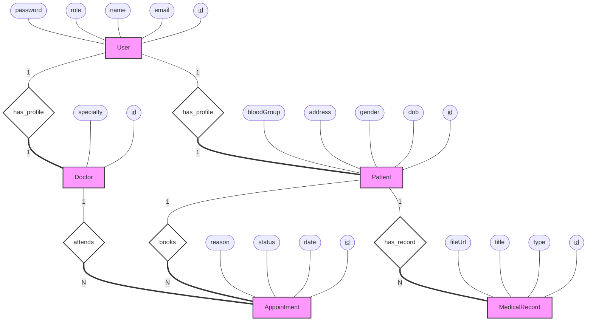

# Classic ER Diagram (Chen Notation)

Based on `prisma/schema.prisma`.

**Legend:**
- **Rectangles**: Entities
- **Diamonds**: Relationships
- **Ovals**: Attributes
- **Double Lines**: Total Participation
- **Single Lines**: Partial Participation
- **Underlined Attributes**: Primary Key

## Description of Relationships and Constraints

1.  **User has Patient Profile (1:1)**
    *   **Entities**: User, Patient
    *   **Cardinality**: 1:1. A User can have at most one Patient profile. A Patient profile belongs to exactly one User.
    *   **Participation**:
        *   User: **Partial** (Not all users are patients).
        *   Patient: **Total** (Every patient profile must be linked to a user).

2.  **User has Doctor Profile (1:1)**
    *   **Entities**: User, Doctor
    *   **Cardinality**: 1:1. A User can have at most one Doctor profile.
    *   **Participation**:
        *   User: **Partial** (Not all users are doctors).
        *   Doctor: **Total** (Every doctor profile must be linked to a user).

3.  **Patient books Appointment (1:N)**
    *   **Entities**: Patient, Appointment
    *   **Cardinality**: 1:N. A Patient can book multiple appointments. An appointment is booked by one Patient.
    *   **Participation**:
        *   Patient: **Partial** (A patient might not have any appointments yet).
        *   Appointment: **Total** (An appointment must exist for a patient).

4.  **Doctor attends Appointment (1:N)**
    *   **Entities**: Doctor, Appointment
    *   **Cardinality**: 1:N. A Doctor can accept multiple appointments. An appointment is attended by one Doctor.
    *   **Participation**:
        *   Doctor: **Partial** (A doctor might not have appointments scheduled).
        *   Appointment: **Total** (An appointment must have a doctor assigned).

5.  **Patient has MedicalRecord (1:N)**
    *   **Entities**: Patient, MedicalRecord
    *   **Cardinality**: 1:N. A Patient can have multiple medical records. A record belongs to one Patient.
    *   **Participation**:
        *   Patient: **Partial** (A patient might be healthy/new and have no records).
        *   MedicalRecord: **Total** (A record cannot exist without a patient).
